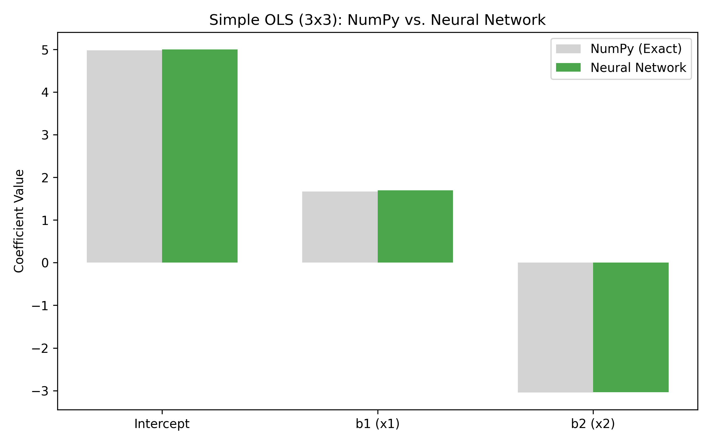
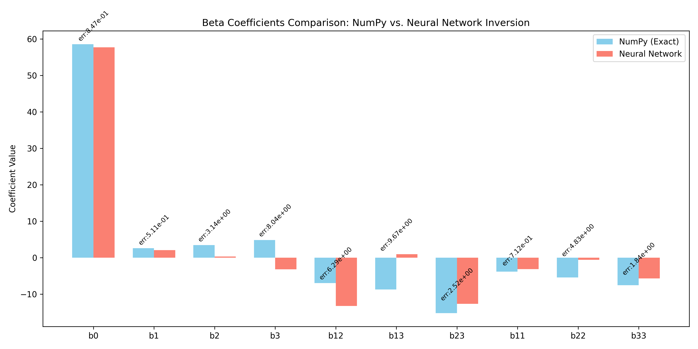
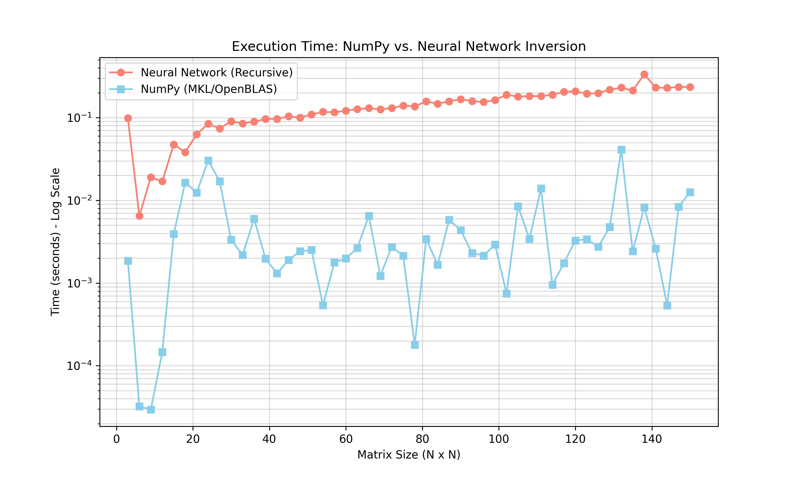

# DeepMatrixInversion Application Examples

This directory contains practical applications of the Neural Network matrix inversion method.

## 1. Simple OLS Regression (3x3 Direct)

`simple_ols_3x3.py` demonstrates a straightforward 3-parameter Ordinary Least Squares (OLS) problem. This example uses a synthetic dataset to fit a linear model:
$y = \beta_0 + \beta_1x_1 + \beta_2x_2 + \epsilon$

Since the resulting Normal Equation matrix ($X^T X$) is exactly **3x3**, it is inverted directly by the neural network without requiring Schur complement recursion or padding.


*(Note: Run the script with --plotout to generate this image locally)*

### Coefficient Comparison:
| Term | NumPy | NN | Diff |
| :--- | :---: | :---: | :---: |
| **Intercept** | 4.9732 | 4.9970 | 2.38e-02 |
| **b1 (x1)** | 1.6677 | 1.6982 | 3.06e-02 |
| **b2 (x2)** | -3.0420 | -3.0340 | 7.97e-03 |

### How to Run:
```bash
# 1. Train a 3x3 model (if not already done)
dmxtrain --msize 3 --epochs 5000 --mout ../Model_3x3

# 2. Run the simple example
python3 simple_ols_3x3.py --mode nn --model ../Model_3x3_YYYYMMDDHHMMSS --plotout simple_ols.png
```

---

## 2. Advanced MLR: Box-Draper Chemical System

We use the dataset from the following textbook:

> **Box, G. E. P. and Draper, N. R. (2007). Response Surfaces, Mixtures, and Ridge Analyses, Second Edition. Wiley.** 
> [DOI: 10.1002/0470072768](https://onlinelibrary.wiley.com/doi/book/10.1002/0470072768)
> **Example 11.3, pages 348–353.** 

The system studies the yield of a consecutive chemical reaction based on three variables:
-   $x_1$: Time (hours)
-   $x_2$: Catalyst (%)
-   $x_3$: Temperature (°C)

The goal is to fit a second-order polynomial model:
$y = \beta_0 + \beta_1x_1 + \beta_2x_2 + \beta_3x_3 + \beta_{12}x_1x_2 + \beta_{13}x_1x_3 + \beta_{23}x_2x_3 + \beta_{11}x_1^2 + \beta_{22}x_2^2 + \beta_{33}x_3^2$

## Implementation Details

### 1. Coded Variables
In response surface methodology, it is standard practice to use "coded" variables. We scale the raw inputs to the range $[-1, 1]$. This is mathematically beneficial for the OLS estimation and aligns the data range with the expectations of our Neural Network model.

### 2. Normal Equations
OLS solves for $\beta$ using the formula:
$\beta = (X^T X)^{-1} X^T Y$

The matrix $X^T X$ for this problem is **10x10**. 

### 3. Recursive Inversion with Padding
Since our base neural network model is trained on **3x3** matrices, we cannot invert the 10x10 matrix directly. The application handles this by:
1.  **Padding**: The 10x10 matrix is padded with an identity block to become **12x12**.
2.  **Recursive Schur Complement**: The 12x12 matrix is recursively inverted using the Schur complement method until it reaches the 3x3 base blocks handled by the neural network.

## How to Run

1.  **Train the Model**:
    Ensure you have a trained 3x3 model ensemble.
    ```bash
    dmxtrain --msize 3 --epochs 5000 --mout ./Model_3x3
    ```

2.  **Run the Example**:
    Provide the path to your trained model directory.
    ```bash
    python3 mlr_box_draper.py --mode nn --model ../Model_3x3_YYYYMMDDHHMMSS --plotout comparison_plot.png
    ```

## Results Visualization

The script generates a comparison between the "exact" coefficients (NumPy) and the neural network's approximation. 

### Comparison of Beta Coefficients:
| Term | NumPy | NN | Diff |
| :--- | :---: | :---: | :---: |
| **b0** | 58.5587 | 57.7121 | 8.4655e-01 |
| **b1** | 2.6229 | 2.1123 | 5.1062e-01 |
| **b2** | 3.4881 | 0.3515 | 3.1366e+00 |
| **b3** | 4.8791 | -3.1589 | 8.0380e+00 |
| **b12** | -6.9231 | -13.2173 | 6.2942e+00 |
| **b13** | -8.6988 | 0.9694 | 9.6682e+00 |
| **b23** | -15.1579 | -12.6345 | 2.5234e+00 |
| **b11** | -3.8133 | -3.1012 | 7.1215e-01 |
| **b22** | -5.3824 | -0.5475 | 4.8349e+00 |
| **b33** | -7.5047 | -5.6599 | 1.8448e+00 |

**Mean Absolute Difference:** 3.8409e+00


*(Note: Run the script with --plotout to generate this image locally)*

The comparison shows how well the neural network, even when trained on tiny 3x3 matrices, can be used to solve much larger, real-world regression problems through recursive decomposition.

---

## 3. Benchmark: Execution Time Comparison

`benchmark_inversion.py` compares the execution speed of the **Neural Network (Recursive)** method vs. the highly optimized **NumPy (LAPACK/BLAS)** implementation. 

The script benchmarks matrices of size $N \times N$, where $N$ increases as multiples of the model's base size (e.g., 3, 6, 9, 12, ...). 

### How to Run:
```bash
python3 benchmark_inversion.py --model ../Model_3x3_YYYYMMDDHHMMSS --max_k 10 --plotout benchmark_results.png
```

### Performance Benchmark (Mac M2 Pro)

The following benchmark was performed on a **Mac M2 Pro**, comparing the optimized Neural Network (Recursive) method against NumPy's LAPACK-based inversion. 

*Note: After graph optimization and ensemble fusion, the 150x150 inversion time improved from ~2.7s to ~0.23s.*

| Size (N x N) | NumPy (s) | NN (s) |
| :--- | :---: | :---: |
| **3x3** | 0.00186 | 0.09893 |
| **6x6** | 0.00003 | 0.00649 |
| **15x15** | 0.00392 | 0.04744 |
| **30x30** | 0.00334 | 0.09050 |
| **45x45** | 0.00190 | 0.10393 |
| **60x60** | 0.00198 | 0.12132 |
| **75x75** | 0.00214 | 0.13998 |
| **90x90** | 0.00436 | 0.16692 |
| **105x105** | 0.00849 | 0.17924 |
| **120x120** | 0.00327 | 0.20806 |
| **135x135** | 0.00242 | 0.21255 |
| **150x150** | 0.01255 | 0.23395 |


